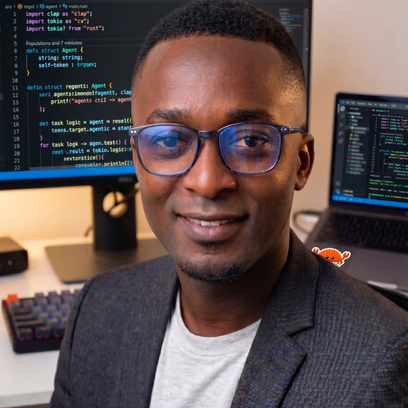

<div align="center">



# Ager Austine

### 🧠 Machine Learning / MLOps Engineer — Scientific ML & Agentic Systems

_Shipping models end-to-end: research → evaluation → production. No slide decks, just repos that run._

📍 Nairobi, Kenya

[](mailto:agerausten@gmail.com)
[](https://www.linkedin.com/in/ager-austine/)
[](https://github.com/ageraustine)
[](https://ageraustine.github.io)

</div>

<br>

## 👋 About

I work where **scientific ML** meets **applied MLOps** — physics-informed neural networks, neural operators, and graph neural networks on one side; Docker, CI/CD, and infra-as-code on the other. I've owned models end-to-end, from research and training through production deployment, including building the evaluation harnesses that catch failures before customers do.

Most recently: I built and shipped a text-to-music generation model, and designed a multi-agent system that processes millions of media files for a fraction of the cost naive LLM-context routing would take.

I'm comfortable in ambiguity — turning messy real-world system behavior into structured evaluation frameworks, and working directly with domain experts (audio engineers, producers, researchers) to raise signal quality.

<br>

## ⚡ Currently

```text
role      : AI Engineer @ Rightsify
building  : Hydra II — text-to-music generation, in production
co-founder: Wanx AI — Nairobi-based AI venture
researching: PINNs · Neural Operators (DeepONet) · Neural ODEs · GNNs
```

<br>

## 🛠️ Stack

<div align="center">


</div>

| Domain | Focus |
|---|---|
| 🔬 **Scientific ML** | Physics-informed neural networks (PINNs), neural operators (DeepONet), neural ODEs, Graph Neural Networks |
| 🤖 **Agentic Systems** | Multi-agent LLM orchestration, tool-use design, cost-aware context routing |
| ⚙️ **MLOps** | Training/inference pipelines, Dockerized services, CI/CD, infra-as-code, model release gating |
| 🎧 **Applied Domains** | Generative audio/music models, evaluation & QA design |

<br>

## 🚀 Featured Projects

<table>
<tr>
<td width="50%" valign="top">

### 🎛️ [AIDAW — Agentic Media Engine](https://github.com/ageraustine/daw-agents)
`Rust`

Multi-agent system (Supervisor, Reaper, FFmpeg, Search, Data — 70+ tools) letting studios process millions of media files via natural language.

- 💸 **99%+ cost cut** via observation masking — $2.40 vs $15,000 to process 1M files
- 📇 2.5M files indexed in ~3 minutes, millisecond search
- 🔌 Multi-provider: Claude, GPT, Grok, local Ollama

</td>
<td width="50%" valign="top">

### ⚽ [MARL Football](https://github.com/ageraustine/marl-football)
`Python`

Multi-agent RL environment for full 11-a-side football on PettingZoo, Gymnasium, RLlib, and raylib.

- 📈 Staged curriculum, 1v1 → full 11v11 (15M steps)
- 🧩 Fixed-length observation space — checkpoints restore across squad sizes
- 🏁 Real ruleset subset: offside, throw-ins, corners, stamina decay

</td>
</tr>
<tr>
<td width="50%" valign="top">

### 🀄 [MARL Mahjong](https://github.com/ageraustine/mahjong-marl)
`Python`

Multi-agent RL environment for 4-player Chinese Official (MCR) Mahjong — full rules engine, self-play training, raylib GUI.

- 🎴 144-tile wall, chi/pong/kong claim priority, 77 of MCR's 81 fan-scoring patterns
- 🎯 Flat 141-action space with per-step legality as an action mask
- 💰 Reward = real points swing per action — optimizes actual match settlement

</td>
<td width="50%" valign="top">

### 🌀 [Neural ODEs — PyTorch Portfolio](https://github.com/ageraustine/neural-ode)
`Python` `PyTorch`

Three self-contained Neural ODE projects spanning the range of "replace discrete layers with an ODE solve."

- Spiral (reference case) · Pendulum (physics discovery) · Latent ODE (generative, irregular time)
- Built on `torchdiffeq`, adjoint-sensitivity aware

</td>
</tr>
<tr>
<td width="50%" valign="top">

### 🧮 [Neural Operators — DeepONet](https://github.com/ageraustine/neural-operators)
`Python` `PyTorch`

Branch/trunk DeepONet architectures learning solution operators for differential equations.

- Antiderivative operator + full spacetime Burgers' PDE solver
- Self-contained numerical solver for training data + unseen-condition evaluation

</td>
<td width="50%" valign="top">

### 🔧 [GarageOS](https://github.com/ageraustine/garageos)
`FastAPI` `Next.js` `PostgreSQL` `M-Pesa`

Trust-infrastructure platform for multi-branch auto-repair chains in East Africa — trust measured at the moment of work, shown to the customer instantly, and rolled up to the brand in real time.

- 🔗 **Magic link** repair tracking via WhatsApp/SMS — estimates, approvals, and M-Pesa payment, no app install
- 🏆 **Trust Score** per job: estimate accuracy (35%), verification rate (25%), timeliness (20%), quality/comeback rate (20%)
- 🏢 Full job workflow (intake → diagnosis → working → washing → ready → paid) + HR module + multi-branch HQ visibility

</td>
<td width="50%" valign="top">

### ✍️ [R.O.A.D. — Historical HTR Pipeline](https://github.com/ageraustine/OCR-ROAD-BARBADOS)
`PyTorch` `Qwen3-VL` `LoRA`

Fine-tuning and evaluation pipeline for historical document handwriting recognition, built on Qwen3-VL vision-language models and tuned for degraded archival records.

- 🎯 **Asymmetric LoRA** — high-rank (r=64) on the vision tower for stroke/degradation detail, lower-rank (r=16/32) on the language model
- 🩹 **Condition-aware augmentation** — scores 5 degradation metrics per document and swaps degradation vs. geometric augmentations accordingly
- 📐 Stratified 90/10 split across 36 bins; scored on blended WER/CER with early stopping

</td>
</tr>
</table>

<br>

## 📊 Experience Log

```
2023 — present   AI Engineer, Rightsify        → shipped Hydra II (text-to-music) to production
2023 — present   Co-Founder, Wanx AI            → Nairobi-based AI venture
2019 — 2025      B.Sc. Aerospace Engineering    → Kenyatta University
2022             AWS ML Foundations             → Udacity
```

<br>

## 📫 Let's talk

Open to conversations on scientific ML, agentic systems, and MLOps roles or collaborations.

<div align="center">

**[agerausten@gmail.com](mailto:agerausten@gmail.com)** · **[WhatsApp](https://wa.me/254743737349)** · **[Signal](https://signal.me/#p/+254743737349)** · **[linkedin.com/in/ager-austine](https://www.linkedin.com/in/ager-austine/)** · **[github.com/ageraustine](https://github.com/ageraustine)**

<sub>Built &amp; deployed like everything else here. 🛰️</sub>

</div>